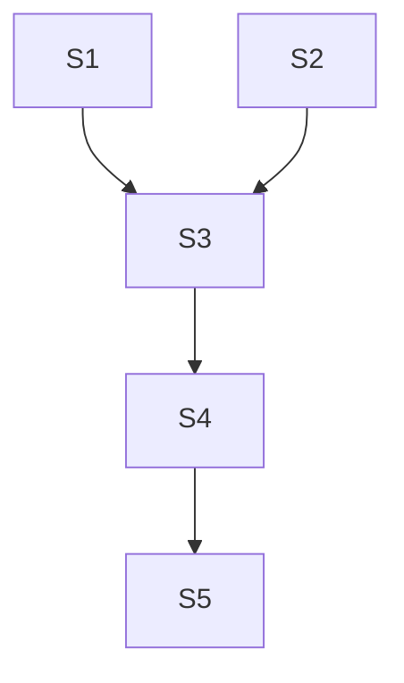

# User Story Documentation Template

This template defines the structure for Stories.md files. Focus on deliverable, testable, engineer-ready user stories.

---

## Template Structure

```markdown
# User Stories: [Feature/Product Name]

## Overview

**Product:** [Product name]
**Phase:** [POC | MVP | Release-1]
**Shaped Solution:** [Reference to ShapedSolution.md]
**Threat Model:** [Reference to ThreatModel.md]
**Ops Readiness:** [Reference to OpsReadiness.md]
**Date:** [YYYY-MM-DD]
**Author:** Suki Story (Story Crafter)

## Story Map

*Backbone (user activities) and priority ordering*

[Mermaid diagram or structured list showing story dependencies]

## MoSCoW Summary

| Priority | Count | Stories |
|----------|-------|---------|
| Must Have | [N] | [Story IDs] |
| Should Have | [N] | [Story IDs] |
| Could Have | [N] | [Story IDs] |
| Won't Have (this phase) | [N] | [Story IDs] |

## Stories

### S1: [Story Title]

**As a** [user role]
**I want** [goal]
**So that** [benefit]

**Priority:** [Must/Should/Could]
**Estimate:** [1-3 days]
**Depends on:** [Story IDs or "None"]
**Blocks:** [Story IDs or "None"]

**Acceptance Criteria:**

```gherkin
Given [context]
When [action]
Then [outcome]

Given [context]
When [action]
Then [outcome]
```

**NFR Criteria:**
- [NFR-S1] [Security criterion from Serena] - Source: ThreatModel
- [NFR-O1] [Operational criterion from Oscar] - Source: OpsReadiness

**INVEST Check:** ✅ Independent | ✅ Negotiable | ✅ Valuable | ✅ Estimable | ✅ Small | ✅ Testable

---

### S2: [Story Title]

[Same structure repeated for each story]

---

## Dependency Chain

[Mermaid diagram showing story dependencies]



## NFR Source Traceability

| NFR ID | Source | Source Document | Stories Applied To |
|--------|--------|----------------|-------------------|
| NFR-S1 | Security | ThreatModel.md | S1, S3 |
| NFR-O1 | Operations | OpsReadiness.md | S2, S4 |

## Handoff Notes

**For Technical Designer (Dylan):** [Key implementation considerations per story grouping]
**For Engineer (Bea):** [Suggested implementation order following dependency chain]

## References

[Source citations including upstream artifacts]
```

---

## Guidelines

**Do:**
- Write stories that an engineer can pick up and finish in 1-3 days
- Include testable Given/When/Then acceptance criteria on every story
- Bake NFRs into acceptance criteria, not as separate documents
- Map dependencies explicitly -- no hidden ordering assumptions
- INVEST check every story before it leaves this document
- Cite upstream artifacts (ShapedSolution, ThreatModel, OpsReadiness)

**Don't:**
- Write stories bigger than 3 days (split them)
- Accept vague acceptance criteria ("it should be fast")
- Skip dependency mapping
- Ignore security or ops NFRs
- Leave ambiguous stories -- if an engineer can't tell when it's done, rewrite it

---

## Empty Section Handling

Every Stories.md must include ALL sections. If no data exists:

```markdown
## NFR Source Traceability

*No NFRs documented yet. This section needs input from security (Serena) and operations (Oscar).*
```

This highlights gaps rather than hiding them.

---

## Section Quick Reference

| Section | Key Question | Owner |
|---------|--------------|-------|
| Overview | What are we building? | Product/Suki |
| Story Map | How do stories relate to the user journey? | Suki |
| MoSCoW Summary | What's in/out for this phase? | Suki/Product |
| Stories | What exactly does each story deliver? | Suki |
| Dependency Chain | What order must stories be built? | Suki |
| NFR Traceability | Where did each NFR come from? | Suki/Security/Ops |
| Handoff Notes | What does the next person need to know? | Suki |
| References | Where did this come from? | All |
